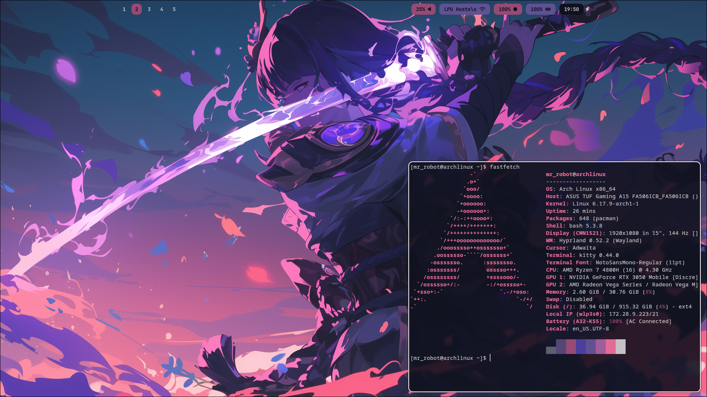

# Hyprland Rice

A minimal Arch Linux setup built around Hyprland, with pywal-driven theming and a focus on a clean, distraction-free workflow.

Automatic wallpaper change upon switching workspaces

This is my daily driver configuration.

---

## Screenshots





---

## System

- OS: Arch Linux  
- Window Manager: Hyprland  
- Terminal: kitty  
- Shell: bash  
- Bar: waybar  
- Launcher: wofi  
- File Manager: yazi    
- Color scheme: pywal  
- Wallpaper Manager: swww

---

## Theming

Colors are generated using pywal and applied consistently across the system.

- Wallpaper-driven color generation
- Shared color palette for kitty, waybar, wofi, and yazi
- Yazi colors are generated using a custom pywal template
- RGB Keyboard backlit sync with wallpaper (asusctl)

To add more wallpapers, add a similar bind line to hyprland's config file.

```bash
bind = $mainMod, 4, exec, swww img ~/Pictures/Wallpapers/neon_tokyo.webp --transition-duration 0.5   --transition-fps 144 && wal -i ~/Pictures/Wallpapers/neon_tokyo.webp
```

Replace the path with the wallpaper's

---

## Keybindings (selected)

| Key | Action |
|----|-------|
| Super + Enter | Open terminal |
| Super + (1/2/3) | Switch workspace+wallpaper+theme|
| Super + E | File manager |
| Print | Screenshot (select area, save to file, copy to clipboard) |

---

## Dotfiles

This repository uses a bare Git repository to manage dotfiles.

To check out the configuration on a new system:

```bash
git clone --bare git@github.com:Niranj-S/hyprland-rice.git ~/.dotfiles
alias dots='/usr/bin/git --git-dir=$HOME/.dotfiles --work-tree=$HOME'
dots checkout
